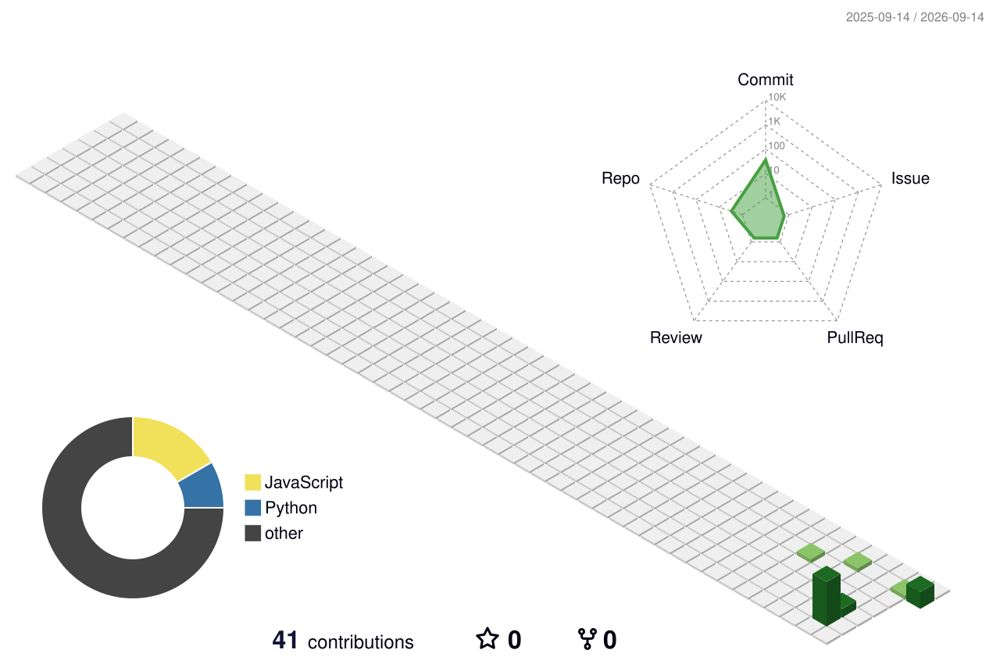

<!-- ========================================================= -->
<!--                    SYED JUNAID QUADRI                     -->
<!--                 GitHub Profile README                     -->
<!-- ========================================================= -->

<div align="center">


<br>


<br><br>

<a href="https://github.com/Syedjunaid23">

</a>

<a href="https://github.com/Syedjunaid23">

</a>

<a href="https://github.com/Syedjunaid23">

</a>

<a href="https://github.com/Syedjunaid23">

</a>

</div>

---

# 👋 ABOUT ME

```text
┌─────────────────────────────────────────────────────────────┐
│                                                             │
│  👨‍💻  SYED JUNAID QUADRI                                    │
│                                                             │
│  🏗️  BIM Engineer                                          │
│  🔧  Revit / MEP / Navisworks / Dynamo                      │
│  🧩  BIM Coordination                                      │
│                                                             │
│  🚧  Computational Engineering — IN PROGRESS                │
│  🚧  Engineering Automation — IN PROGRESS                   │
│  🚧  Game Development — IN PROGRESS                         │
│                                                             │
│  Building from BIM → Programming → Engineering Computing   │
│                                                             │
└─────────────────────────────────────────────────────────────┘
```

I work in **BIM and MEP**, with a strong interest in using programming, automation and computational methods to build better engineering workflows.

My GitHub is where I document what I **build, learn, test and experiment with**.

---

# 🏗️ BIM ENGINEERING

<div align="center">

### CURRENT CORE


<br><br>


</div>

<div align="center">

`Revit MEP` · `MEP Coordination` · `Families` · `Clash Detection` · `Model Coordination` · `BIM Data`

</div>

---

# 🧮 COMPUTATIONAL ENGINEERING

<div align="center">


<br><br>


<br><br>

`NumPy` · `SciPy` · `Pandas` · `Matplotlib` · `Numerical Computing` · `Simulation`

<br><br>

**Status:** 🟠 Learning → 🟡 Practicing → 🟢 Building

</div>

---

# ⚙️ ENGINEERING AUTOMATION

<div align="center">


<br><br>


</div>

<div align="center">

`Dynamo` · `Python` · `C#` · `Revit API` · `BIM Automation`

</div>

---

# 🎮 GAME DEVELOPMENT

<div align="center">


<br><br>


</div>

<div align="center">

`Unity` · `C#` · `Blender` · `3D` · `Game Development`

</div>

---

# 🧰 TECHNOLOGY STACK

<div align="center">

### 🏗️ ENGINEERING


<br>

`Revit` `Revit MEP` `Navisworks` `Dynamo` `ACC` `BIM 360`

---

### 💻 PROGRAMMING


---

### 🧮 COMPUTING


<br>

`NumPy` `Pandas` `SciPy` `Matplotlib`

---

### 🌊 SIMULATION

`OpenFOAM` `PyroSim` `FDS` `ParaView`

---

### 🎮 3D / GAME DEV


</div>

---

# 📊 SKILL MATRIX

```text
╔══════════════════════════════════════════════════════════╗
║                     SKILL MATRIX                         ║
╠══════════════════════════════════════════════════════════╣
║                                                          ║
║ 🏗️  BIM                                                   ║
║     Revit             ██████████  CORE                   ║
║     Revit MEP         ██████████  CORE                   ║
║     Navisworks        █████████░  CORE                   ║
║     Dynamo             ███████░░░  DEVELOPING             ║
║                                                          ║
║ 🐍  PROGRAMMING                                           ║
║     Python             █████░░░░░  LEARNING              ║
║     C#                 ████░░░░░░  LEARNING              ║
║     C++                ██░░░░░░░░  FUTURE                ║
║     JavaScript         ███░░░░░░░  LEARNING              ║
║                                                          ║
║ 🧮  COMPUTATIONAL ENGINEERING                             ║
║     Numerical Computing ███░░░░░░░  WIP                  ║
║     Scientific Python   ███░░░░░░░  WIP                  ║
║     CFD                 ██░░░░░░░░  WIP                  ║
║                                                          ║
║ ⚙️  AUTOMATION                                            ║
║     Dynamo              ████░░░░░░  WIP                  ║
║     Python Automation   ███░░░░░░░  WIP                  ║
║     Revit API           ██░░░░░░░░  WIP                  ║
║                                                          ║
║ 🎮  GAME DEVELOPMENT                                      ║
║     Unity               ██░░░░░░░░  WIP                  ║
║     Blender             ███░░░░░░░  WIP                  ║
║                                                          ║
╚══════════════════════════════════════════════════════════╝
```

---

# 🧪 PROJECT LAB

<div align="center">

### 🏗️ BIM PROJECTS

</div>

```text
┌──────────────────────────────────────────────────────────┐
│                                                          │
│  PROJECT 01                                               │
│  ───────────────────────────────────────────────────────  │
│  Revit MEP Automation                                     │
│                                                          │
│  Technology: Revit • Dynamo • Python                    │
│  Status:    🚧 Building                                  │
│                                                          │
├──────────────────────────────────────────────────────────┤
│                                                          │
│  PROJECT 02                                               │
│  ───────────────────────────────────────────────────────  │
│  BIM Coordination Workflow                                │
│                                                          │
│  Technology: Revit • Navisworks                           │
│  Status:    🚧 Building                                  │
│                                                          │
├──────────────────────────────────────────────────────────┤
│                                                          │
│  PROJECT 03                                               │
│  ───────────────────────────────────────────────────────  │
│  Engineering Computing                                    │
│                                                          │
│  Technology: Python • NumPy • Matplotlib                 │
│  Status:    🟠 Learning                                  │
│                                                          │
└──────────────────────────────────────────────────────────┘
```

> Projects will be added here as they are completed.

---

# 📚 CURRENT LEARNING

<div align="center">

**BIM** · **Python** · **C#** · **Computational Engineering** · **Automation** · **Game Development**

<br>

`████████░░` BIM &nbsp;&nbsp; `█████░░░░░` Python &nbsp;&nbsp; `████░░░░░░` C#

`███░░░░░░░` Computational Engineering &nbsp;&nbsp; `███░░░░░░░` Automation &nbsp;&nbsp; `██░░░░░░░░` Game Development

</div>

---

# 🐍 PYTHON

<div align="center">


<br><br>

**ACTIVE** · `Fundamentals` · `OOP` · `NumPy` · `Pandas` · `Matplotlib` · `Automation`

</div>

---

# 🔷 C#

<div align="center">


<br><br>

**ACTIVE** · `Fundamentals` · `OOP` · `.NET` · `Revit API` · `Unity`

</div>

---

# 🌊 CFD — SEPARATE ENGINEERING FOCUS

<div align="center">

`OpenFOAM` · `PyroSim` · `FDS` · `ParaView`

<br>

**Status:** 🚧 Learning & Experimenting

</div>

---

# 📈 GITHUB ACTIVITY

<div align="center">


<br>


<br>


</div>

---

# 🏆 CONTRIBUTIONS

<div align="center">


</div>

---

# 🧊 3D CONTRIBUTION GRAPH

<div align="center">



</div>

---

# 🐍 CONTRIBUTION SNAKE

<div align="center">


</div>

---

# 📊 CONTRIBUTION GRAPH

<div align="center">


</div>

---

# 🧭 MY DEVELOPMENT PHILOSOPHY

> Don't just learn the tool.  
> Understand the problem, build the solution, and document the process.

---

# 🚀 BUILDING TOWARD

<div align="center">

| TODAY | BUILDING | NEXT |
|:---:|:---:|:---:|
| 🏗️ **BIM ENGINEER** | 🐍 Python · 🔷 C# · 🧮 Computing | 🧮 **COMPUTATIONAL ENGINEER** |
| | ⚙️ **ENGINEERING AUTOMATION** | |
| | 🌊 CFD · 🛠️ ENGINEERING TOOLS | |
| | 🎮 **3D / GAME DEVELOPMENT** | |

</div>

---

# 📂 REPOSITORIES

<div align="center">

<a href="https://github.com/Syedjunaid23?tab=repositories">

</a>

</div>

<br>

```text
🏗️ BIM
🧮 COMPUTATIONAL ENGINEERING
⚙️ AUTOMATION
🎮 GAME DEVELOPMENT
🐍 PYTHON
🔷 C#
🌐 WEB
🧪 EXPERIMENTS
```

---

# 📫 CONNECT

<div align="center">

<a href="https://github.com/Syedjunaid23">

</a>

<!-- Add your LinkedIn -->
<a href="#">

</a>

<!-- Add your portfolio -->
<a href="#">

</a>

</div>

---

<div align="center">


<br><br>

### 🏗️ BIM TODAY
### 🧮 COMPUTATIONAL ENGINEERING TOMORROW
### ⚙️ AUTOMATION ALONG THE WAY
### 🎮 BUILDING GAMES TOO

<br>


</div>

<!-- ========================================================= -->
<!--                    END OF README                          -->
<!-- ========================================================= -->
